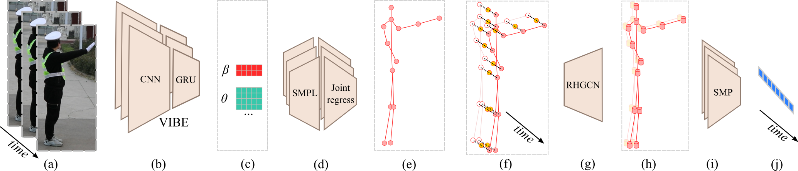

# Monocular Traffic Police Gesture Recognizer

<p align="center">
    
</p>

## Install

**(Corresponding downloads are under preparation)**

1. Download [vibe_data](https://drive.google.com/file/d/12D5lLbhpaTVW-31N5NLj30_mDF1rHWbJ/view?usp=sharing), save into ./data/vibe_data.

2. Download [four-directional police gesture dataset](https://drive.google.com/file/d/17fav_gvVtdJm9l6n36eue4DmljI6yT1V/view?usp=sharing), extract into ./data/police_gesture_v2

3. Download [MTPGR checkpoints](http://), save into ./data/checkpoints

### Expected file structure

``` 
- mtpgr     // Main files
- configs   // Configs for MTPGR
- data      // This folder should be downloaded
    - vibe_data             // Model for VIBE network
    - police_gesture_v2     // Four-directional police gesture dataset
    - checkpoints           // checkpoints for MTPGR
```

### PyCharm setup
Open the "MTPGR" folder as the project folder, the PYTHONPATH should be set by PyCharm into project folder.

### VS code setup

Open the "MTPGR" folder as the project folder, and add following lines into launch.json to set PYTHONPATH
```
"cwd": "${workspaceFolder}",
"env": {"PYTHONPATH": "${cwd}"}
```

### Run from terminal
Set PYTHONPATH environment variable as "(your path)/MTPGR".

4. Install PyTorch environments
```
# .../MTPGR/mtpgr$
source scripts/install_conda.sh
```

5. Install the real-time inference VIBE:

``` bash
pip install git+https://github.com/zc402/RT-VIBE
```

## Dataset preprocess

- The dataset preprocess must be executed before training and testing
```
# .../MTPGR/mtpgr$
python ./preprocess/1_llc_to_class.py       // convert time duration label to per-frame label
python ./preprocess/2_video_to_images.py    // split video into images
python ./preprocess/3_images_to_track.py    // track person inside each video
python ./preprocess/4_find_police_track.py  // find the track of police and discard other tracks
python ./preprocess/5_track_to_vibe.py      // parse vibe parameters from the police track
```

## Test

- Run the test script
```
python ./test.py
```

**TODO: Add explanation for different configs**

## Train

1. Run the model training script

```
python ./train.py
```

**TODO: Add explanation for different configs**

## The four-directional police gesture dataset

** under preparation **